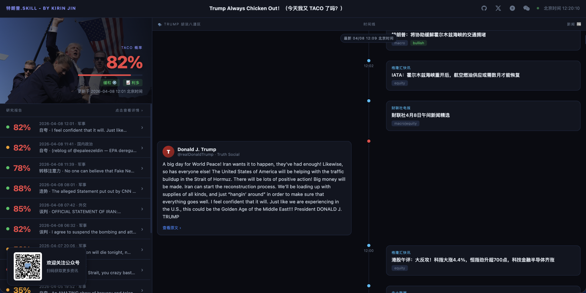
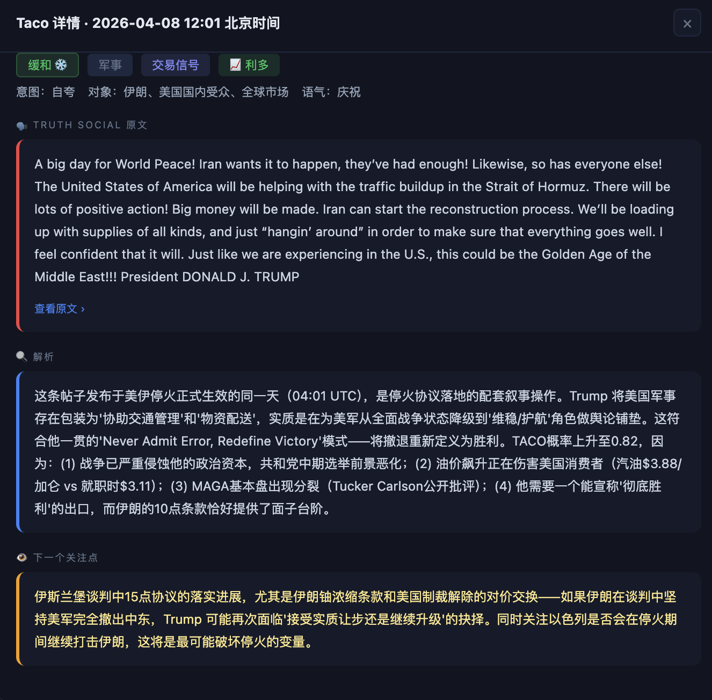

# 特朗普.SKILL

> *「TACO告诉你他大概率会怂。我告诉你他为什么会怂，什么条件下不会怂。」*
trump.kirinjin.com

 

**把特朗普「蒸馏」成了一个 AI Skill，用来预判他什么时候会怂、什么时候不会。**

 

[为什么做这个](#为什么-taco-不够用) · [数据源](#数据源) · [伊朗案例](#为什么-taco-在伊朗失效了) · [在线应用](#应用实时-taco-概率--ai-trump-分析) · [开源](#开源)

 

### KirinJIN

 

💬 **微信公众号** — 扫码关注 ↓

---

## 为什么 TACO 不够用

2025年，华尔街有一条铁律叫 **TACO** —— Trump Always Chickens Out。特朗普总是临阵退缩。

Liberation Day 180国加关税，全球崩盘，7天后他自己叫暂停。50%欧洲关税，48小时反转。对加拿大、墨西哥，反复横跳。TACO交易，2025年稳赚不赔。每次崩盘抄底，每次反弹收割。

**然后3月1日，他轰炸了伊朗。**

他真打了。TACO剧本，一个字都对不上了。38天战争，纳指暴跌，油价飙涨。

TACO只告诉你他「通常」会怂。**它没有告诉你，什么情况下他不会怂。**

要回答这个问题，唯一的办法是——问问特朗普本人。

于是我把特朗普「蒸馏」了。

---

## 数据源

把这个男人能找到的所有公开资料，全部喂了进去：

| 类别 | 内容 | 规模 |
|------|------|------|
| 🐦 推文 | 46,694 条原创推文，逐条做用词分析、情绪标注、节奏拆解 | 8,465次「great」、916次「fake news」、364次「witch hunt」 |
| 🎙️ 访谈 | Joe Rogan 3小时长篇（他讲了72%的时间）、TIME年度人物专访11,345字、Howard Stern | 全部逐句拆解 |
| 📚 他的书 | 7本，从1987年 *The Art of the Deal* 到2015年 *Crippled America* | 38年操作系统，从未更新 |
| 🔍 身边人的书 | Woodward的 *Fear* 和 *Rage*，Bolton的 *The Room Where It Happened*，Mary Trump的 *Too Much and Never Enough* 等6本 | 镜头关掉之后的那个人 |
| 🧠 学术研究 | 西北大学McAdams教授整本书拆人格模型，耶鲁Bandy Lee团队27-50位精神科医生联合分析 | 临床病例级研究强度 |
| 📋 政策记录 | 2025-2026第二任期全部记录 | 143道行政命令、关税数据、国会追踪 |

从这一整堆东西里面，提炼出 **6套心智模型、8条决策本能、一整套表达DNA**，以及最关键的——**什么情况下他会收手，什么情况下他不会。**

---

## 为什么 TACO 在伊朗失效了？

如果你读过这套心智模型，答案不复杂：

**TACO成立的底层逻辑：** Trump有一条决策本能叫「Threats Are Leverage, Not Commitments」——威胁是筹码，不是承诺。大多数时候，他的狠话就是开价，不是交货。

**但伊朗触发了另一条本能：**「Personalize Everything」——政策纠纷变成私人恩怨。这不是在谈国家利益，这是在谈面子。

而且他的 **四条让步触发条件，一条都没被激活**：

1. ❌ 市场崩到心理阈值 — 油价飙升利好能源股，「成绩单」没崩
2. ❌ 大金主造反 — 军工大金主反而在鼓掌
3. ❌ 对手给台阶 — 伊朗前38天一直强硬，直到停火才给了台阶
4. ❌ 基本盘动摇 — MAGA对打伊朗支持率一直很高

**四条触发条件，零条激活。所以他没有怂。**

TACO看不到这些。TACO只有一个维度：「他以前怂过，所以这次也会怂」。这就像只看K线不看基本面。

---

## 应用：实时 TACO 概率 + AI Trump 分析

👉 **[trump.kirinjin.com](https://trump.kirinjin.com/)**

TACO告诉你他大概率会怂。这个SKILL告诉你他**为什么**会怂，**什么条件下**不会怂，以及**现在那些条件是否已经被触发**。

- 🔴 **实时 TACO 概率** — 动态刷新特朗普退缩概率
- 🐦 **实时推文追踪** — 特朗普最新表态
- 📰 **近期相关新闻** — 与他相关的最新动态
- 🧠 **每次表态深度分析** — 让特朗普.SKILL去分析特朗普是怎么想的

---

## 开源

Skill的全部研究资料、心智模型拆解、46,694条推文的量化分析数据，都在这个仓库里。

想拿去做自己的分析工具，想验证结论对不对，想改进模型，欢迎。

---

**TACO** 告诉你他大概率会怂。 
**特朗普.SKILL** 告诉你为什么，以及什么时候不会。  
*与其猜，不如让 Trump 自己告诉你。*

 

MIT License © [KirinJIN](https://github.com/KirinJin2046)

---

> This Skill was generated by [Nuwa · Skill Distillation](https://github.com/alchaincyf/nuwa-skill)

