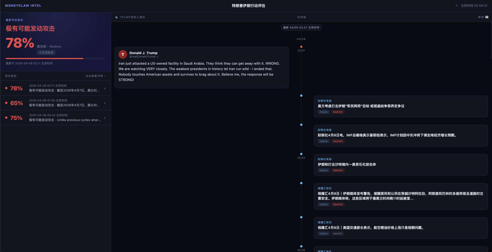

# Trump · Digital Twin

我们造了一个 **Trump 的数字分身**。

他读过 Trump 读过的书，听过他说过的话，研究过他发过的每一条推文。具体来说：

- **46,694 条原创推文**逐条分析用词、情绪、节奏
- **3 小时+长篇访谈**（Joe Rogan、TIME 年度人物、Howard Stern）
- **7 本 Trump 著作**（从 *The Art of the Deal* 到 *Crippled America*）
- **6 本内部人士回忆录**（Woodward、Bolton、Mary Trump 等身边人怎么看他）
- **学术心理学研究**（西北大学 McAdams、耶鲁 Bandy Lee 等专业拆解）
- **2025–2026 全部政策记录**（行政命令、关税数据、国会追踪）

从这些材料里，我们提炼出了他的 **6 套心智模型、8 条决策本能、一整套表达 DNA**，以及——最关键的——**什么情况下他会让步**。

---

## 应用：让 Trump 自己告诉你，还打不打

👉 **[trump.kirinjin.com](https://trump.kirinjin.com/)**
*

这个关税战到底还要打多久？与其猜，不如让 Trump 自己评估自己。

一个会画 K 线的 AI Trump，给我们**剧透**：

- 🔴 **实时新闻追踪** — AI Trump 持续获取最新动态
- 🐦 **AI Trump 发推** — 基于实时新闻，用 Trump 的语言风格自动生成 Tweet
- 🧠 **每小时解析** — AI Trump 每小时剖析自己的想法，解读当前局势走向

---

> This Skill was generated by [Nuwa · Skill Distillation](https://github.com/alchaincyf/nuwa-skill)
> Creator: [Huashu](https://x.com/AlchainHust)
